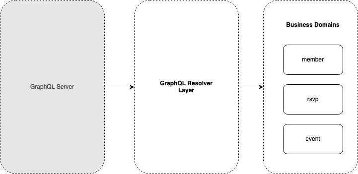
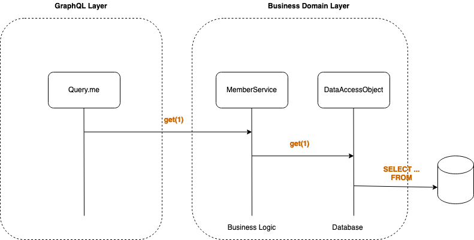

# GraphQL Resolution Demo

This repository was used for a live-demo to show how GraphQL resolution works on a GraphQL server.

### Architecture

This repository models an architecture that isolates core busiess & persitence logic from GraphQL by separating layers in different local yarn modules. The following diagram shows the isolation of a simple version of a "Meetup" graph:



In this model, core business logic modules have no knowledge of GraphQL (or any presentation mechanism for that matter). Each module encapsulates a bounded context within the business. It knows how to get information entities that live in its bounded context, and nothing else. Higher-level layers presentation layers (such as GraphQL) are responsible for tying these modules together.

Below is a diagram of how a given module might be used by a presentation layer such as GraphQL:


- A root GraphQL query (`me`) has a resolver that knows how to determine who the current API caller is and map them to a `memberId`.
- The `me` resolver requests the member with `memberId` to the `MemberService`
- The `MemberService` implements the logic of looking up a member. It forwards forwards the request to a DataAccessObject (or whatever your favorite pattern for encapsulating data lookup is).
- The `MemberDataAccessObject` looks up the `memberId` in its data store and creates a simple object representing the member.
- The `MemberService` would also convert errors such as "member not found" etc, into a form that could be interpretted by presentation layers.


### Running

```sh
cd packages/graphql-server
yarn
yarn start
```

You'll then be able to query the graph on http://localhost:4000
